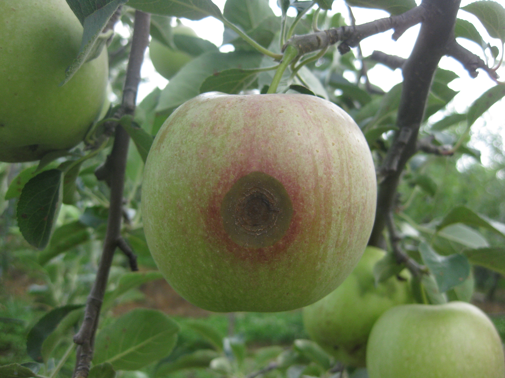
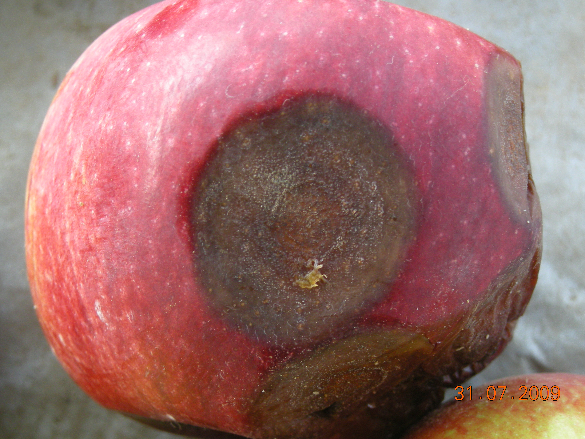
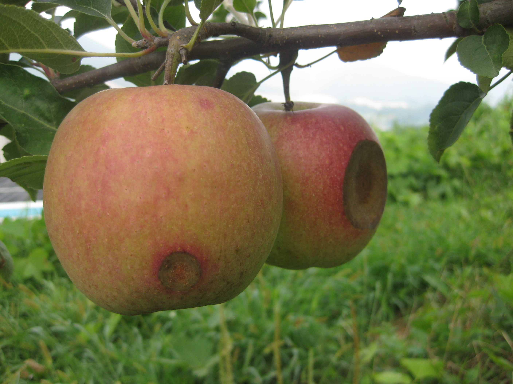

<!-- PROJECT LOGO -->

    <h3 align="center">Dataset: Region Aggregated Attention CNN for Disease Detection in Fruit Images</h3>
    

    74 images of apple fruits were employed to evaluate the performance of the proposed network. A majority of the apples are infected with a disease called Anthracnose. The symptom of the disease generally appears rounded with varying sizes and shows visible variations of patterns within the disease. An experienced expert annotated the region of such rounded symptoms on apple fruits with bounding boxes, serving as ground-truth labels for this study. The total number of the bounding boxes is 182, ranging from 1 to 9 per image. The size of apple images ranges from 500x700 to 3000x2000 and the size of disease symptoms ranges from 50x50 to 2000x1400.
     
        <a href="https://paip2020.grand-challenge.org"><strong></strong></a>
    
      

<!--Table of Contents--!>

<strong>Table of contents</strong>

    <ol>

          <li>Images</li>
          <li>Labels_mask</li>
          <li>Labels_xml</li>

    </ol>

<!--PAIP2020 challenge-->
## Images

<ul>
    <li>
        <strong>Images:</strong>
        

          This folder contains the images of apples which have symptoms of anthracnose.
        

        

          
          
          
        

    </li>
    <li>
        <strong>Labels_mask</strong></li>
        

          This folder contains labeled masks for anthracnose. The value of mask means the instance number.
        

    <li>
        <strong>Labels_xml</strong>
        

          Each XML file contains bounding box annotation.
          <ul>
            <li>The bounding box is specified in the XML files as integer (xmin, ymin) and (xmax, ymax) from the upper left corner of the image</li>
          </ul>
        

    </li>

</ul>
